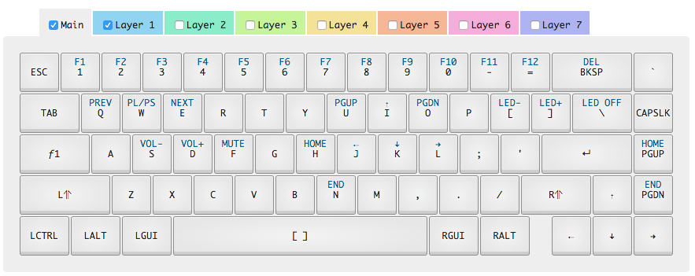

#WhiteFox Layout

Provided by the [Input Club Configurator](https://input.club/configurator) and customized by me.

##Install
Simply enter the directory, press the button on the back of the PCB and run `dfu-util -D kiibohd.dfu.bin`.

